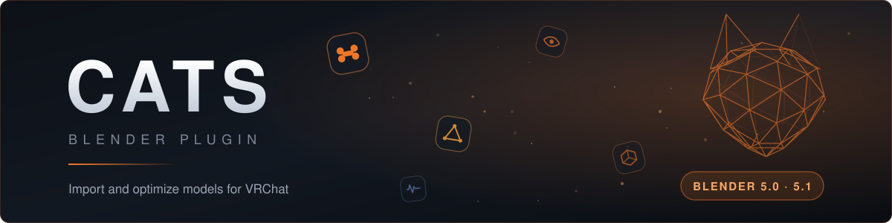
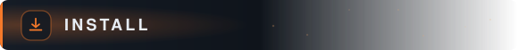
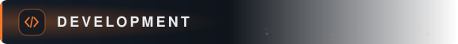

<p align="center">
  
</p>

<p align="center">
  <a href="https://github.com/Zaphkiel-Ivanovna/cats-blender-plugin-unofficial/actions/workflows/ci.yml"></a>
  
  
</p>

Cats takes a model that an importer just dumped into Blender and gets it ready for
VRChat. It renames bones onto a standard skeleton, merges weights off the bones it
deletes, joins meshes, builds visemes and eye tracking, and clears out the leftovers
that MMD and FBX imports leave behind.

It reads rigs from MMD, XNALara, Mixamo, Source Engine, Unreal Engine, DAZ/Poser,
Blender Rigify, Sims 2, Motion Builder and 3DS Max.

This is a fork of [teamneoneko/Cats-Blender-Plugin-Unofficial-][upstream] that targets
Blender 5.0 and 5.1.

<h2 id="install">
  
</h2>

Blender 5.x installs Cats as an extension.

1. Grab `cats_blender_plugin-<version>.zip` from the releases page, or build it from a
   checkout with `blender --command extension build`.
2. In Blender, open **Edit > Preferences > Get Extensions**, use the dropdown at the top
   right, and pick **Install from Disk**.
3. Select the zip. Cats appears in the 3D view sidebar under the **CATS** tab.

The add-on refuses to load outside 5.0 and 5.1, and `blender_manifest.toml` declares the
same bounds, so Blender will not offer it to an unsupported version either.

<h2 id="panels">
  
</h2>

| Panel | What it covers |
| --- | --- |
| Fix Model | The main pass: bone renaming, weight merging, mesh join, shape key cleanup |
| Model Scaling | Resize the armature and its meshes together |
| Optimization | Atlas generation, material operations, bone merging |
| Custom Model Creation | Merge armatures, attach a mesh to an existing rig |
| Eye Tracking | SDK3 eye tracking, plus the legacy bone-based version |
| Visemes | Build the `vrc.v_*` shape keys from three mouth shapes |
| Bone Parenting | Reparent bone chains onto a single root |
| MMD Options | MMD-specific import and cleanup |

<h2 id="what-changed-in-this-fork">
  
</h2>

Everything below is measured on a 323-bone, 14-mesh, 124k-vertex VRChat avatar, and
verified to produce the same model as before.

- **Fix Model runs in 2.0s instead of 11.7s.** Most of it came from two loops that walked
  1.6M UV coordinates and 2.3M shape key vertices one Python call at a time.
- **Update checking works.** Release tags carry the Blender version, and the comparison
  stripped that prefix off one side but not the other, so no update was ever offered.
- **Updates install through Blender.** The updater used to delete every file in its own
  install directory, including the `__init__.py` it was running from, then copy the new
  tree in by hand. It now hands the package to `extensions.package_install_files`.
- **The material slot order is stable.** Blender's FBX importer hands objects back in a
  different order on every run, which used to reshuffle the slots of the joined mesh and
  land in Unity differently each time.
- **TLS certificates are verified again.** The updater disabled verification process-wide
  and never restored it, which affected every other add-on for the rest of the session.

Around thirty other fixes are in the git history, each with what was measured.

<h2 id="development">
  
</h2>

Two suites, both runnable without leaving your checkout.

```sh
pip install -r tests/requirements.txt
python3 tests/static_checks.py                              # no Blender, no network
python3 tests/headless/run.py --blender /path/to/blender    # the real thing
python3 tests/headless/run.py --case mesh                   # one case file
```

`static_checks.py` compiles every file and fails on a `SyntaxWarning`, runs pyflakes
narrowed to undefined names, and checks that the manifest is within schema and that its
Blender bounds match the version gate in `__init__.py`.

The headless suite installs the working tree as an extension into a throwaway directory,
so your own Blender configuration is never touched. Cases live in
`tests/headless/cases/`, and `_models.py` builds synthetic armatures shaped to reach
different branches of Fix Model, which covers 68.8% of its statements. The rest needs
real assets: mmd_tools bone morph data, VRM meshes and Source Engine rigs.

CI runs both against Blender 5.0 and 5.1, builds the extension and keeps the zip as an
artifact. Pushing a tag like `5.0.3.1` runs the same checks, then publishes the zip to a
release. `.github/actions/setup-blender` resolves the latest patch in a series and caches
the tarball, so a warm run skips the 300MB download.

<h2 id="license">
  
</h2>

The combined work is **GPL-3.0-or-later**, and `LICENSE` carries the full text.

Two things put it there. [teamneoneko/Cats-Blender-Plugin-Unofficial-][upstream], the fork
this descends from, is GPL-3.0. And Cats imports `mmd_tools_local`, which is GPL-3.0 and
grants "any later version".

Files carrying an MIT header come from [absolute-quantum/cats-blender-plugin][origin], the
original project, which is MIT. Those headers are correct and stay as they are: MIT is
GPL-compatible, so MIT files can live inside a GPL work.

Bundled in `extern_tools/`:

| Component | License |
| --- | --- |
| `mmd_tools_local` | GPL-3.0-or-later |
| `google_trans_new` | MIT |
| `opencc` | Apache-2.0 |

<h2 id="credits">
  
</h2>

Cats was written by [absolute-quantum][origin] and the GiveMeAllYourCats team, and has
been maintained since by Yusarina and the [Unofficial Cats team][upstream].

[upstream]: https://github.com/teamneoneko/Cats-Blender-Plugin-Unofficial-
[origin]: https://github.com/absolute-quantum/cats-blender-plugin
